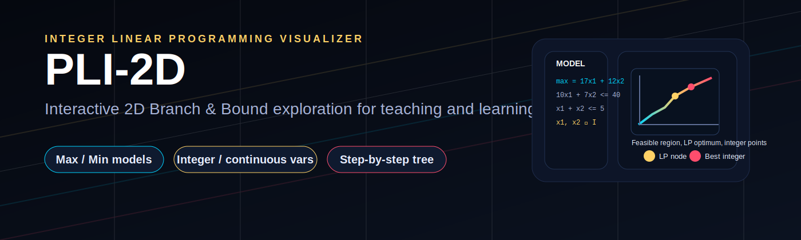
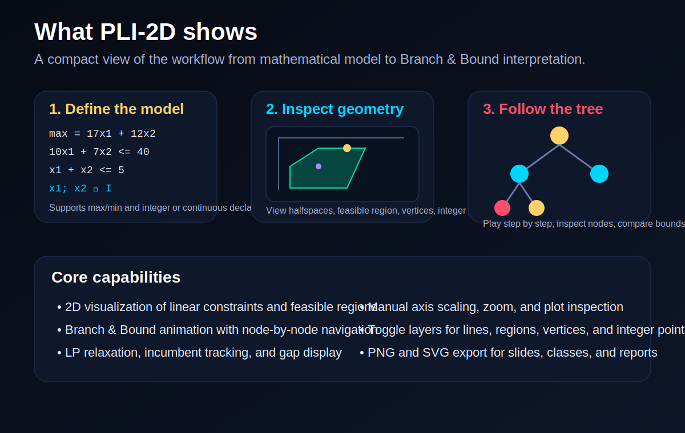

# PLI-2D

<p align="center">
  
</p>

<p align="center">
  <strong>Interactive 2D visualizer for Integer Linear Programming, LP relaxation, and Branch &amp; Bound.</strong>
</p>

<p align="center">
  <a href="#features">Features</a> •
  <a href="#how-it-works">How it works</a> •
  <a href="#getting-started">Getting started</a> •
  <a href="#github-pages">GitHub Pages</a>
</p>

## Overview

**PLI-2D** is an interactive educational tool for exploring **Integer Linear Programming (ILP)** in two dimensions. It lets the user define a model, inspect the feasible region, visualize the LP relaxation, and follow the **Branch & Bound** process step by step.

The current interface already includes support for **max/min models**, **integer and continuous variable declarations**, **layer toggles**, **node-by-node animation**, **zoom and axis control**, and **PNG/SVG export**.

<p align="center">
  
</p>

---

## Features

- **2D geometric interpretation of ILP models**
  - constraints as lines / halfspaces
  - feasible region visualization
  - LP optimum and integer feasible points

- **Branch & Bound visualization**
  - exploration tree
  - current node region
  - incumbent update tracking
  - infeasibility and bound cuts

- **Interactive controls**
  - play / pause animation
  - previous / next node navigation
  - slider-based traversal
  - keyboard shortcuts

- **Plot inspection tools**
  - zoom in / out
  - reset view
  - manual axis scaling
  - point and region inspection

- **Teaching-oriented output**
  - LP relaxation value
  - best integer solution
  - explored node count
  - gap display
  - PNG and SVG export for slides and reports

---

## Why this repository is useful

PLI-2D is especially valuable for:

- **Operations Research** and **Optimization** courses
- explaining the difference between **LP relaxation** and **integer solutions**
- demonstrating how **Branch & Bound** explores and prunes the search tree
- building intuition before introducing solvers such as CBC, GLPK, Gurobi, or CPLEX
- creating visual material for lectures, presentations, and tutorials

---

## How it works

The tool follows a simple workflow:

1. The user writes a 2D linear model.
2. The app parses the objective and constraints.
3. The LP relaxation is solved geometrically.
4. Integer feasibility is checked.
5. If necessary, the model branches on fractional variables.
6. The full Branch & Bound process is shown visually.

This makes the algorithm easier to understand than a purely textual solver log.

---

## Example model

```text
max = 17x1 + 12x2
s.a
10x1 + 7x2 <= 40
1x1 + 1x2 <= 5
x1; x2 ∈ I
```

---

## Getting started

### Option 1 — Open locally

Because the project is client-side HTML/CSS/JavaScript, the simplest way to run it is:

1. Clone the repository
2. Open the main `.html` file in your browser

```bash
git clone https://github.com/YOUR_USERNAME/pli-2d.git
cd pli-2d
```

Then open the main HTML file.

### Option 2 — Publish with GitHub Pages

You can also host the project online as a live demo using GitHub Pages.

---

## Recommended repository structure

```text
pli-2d/
├── index.html            # landing page for GitHub Pages
├── PLI-2D.html           # interactive app / demo
├── assets/
│   ├── banner.svg
│   └── feature-overview.svg
├── screenshots/
│   ├── overview.png
│   ├── plot.png
│   └── tree.png
└── README.md
```

A practical choice is:

- keep `PLI-2D.html` as the actual app
- use `index.html` as a project landing page
- place screenshots in `screenshots/`
- keep reusable visual assets in `assets/`

---

## Suggested screenshots for the README

When you prepare images from the live app, I suggest adding these three:

1. **Full interface overview**
2. **Feasible region with LP solution and integer points**
3. **Branch & Bound tree and node trace**

Then you can insert them like this:

```md
## Interface


## Geometric view


## Branch and Bound tree


```

---

## GitHub Pages

If your repository is named **`pli-2d`**, the usual project page URL will be:

```text
https://YOUR_USERNAME.github.io/pli-2d/
```

A good setup is:

- `index.html` → project landing page
- `PLI-2D.html` → full interactive demo
- landing page button linking to `PLI-2D.html`

---

## Short repository description

Use this in the GitHub repository description field:

> Interactive 2D ILP visualizer with feasible regions, LP relaxation, and Branch & Bound animation.

Alternative shorter version:

> Interactive 2D visualizer for Integer Linear Programming and Branch & Bound.

---

## Suggested topics

Add repository topics such as:

```text
integer-linear-programming
linear-programming
operations-research
optimization
branch-and-bound
visualization
education
javascript
html
```

---

## Future improvements

Some strong next additions for the project:

- support for more input examples
- explanation panels for each branching decision
- export of the Branch & Bound trace as a table
- support for more than two variables in explanatory mode
- optional connection to external solvers for validation
- shareable URLs with encoded models

---

## License

Choose the license that best matches your goal:

- **MIT** if you want maximum reuse
- **Apache-2.0** if you want permissive reuse plus patent protection
- **GPL-3.0** if you want derivatives to remain open source

---

## Citation / attribution

If you publish a paper, class material, or educational content based on this repository, consider adding a formal citation section here later.

---

## Contact

Created by **Prof. Valdecy Pereira**.

If you want, you can later extend this section with:

- institutional affiliation
- email
- project page
- paper or preprint link
