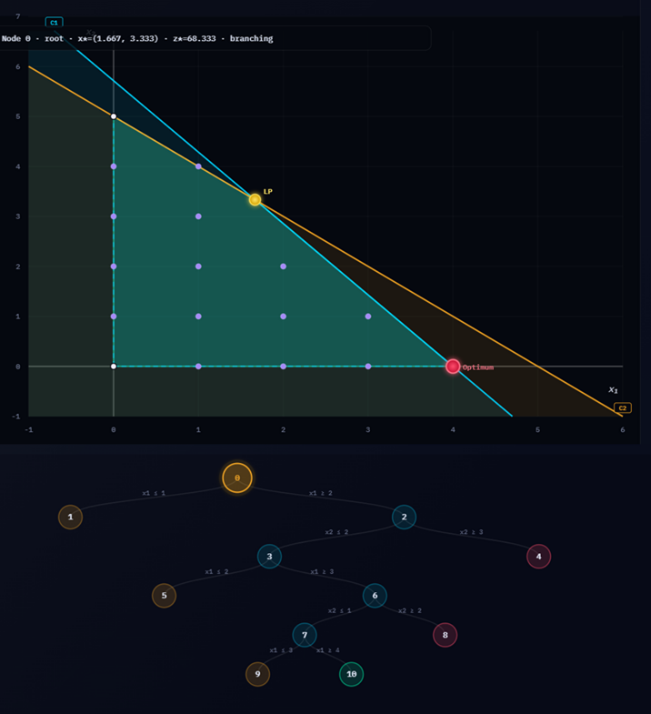

# PLI-2D

<p align="center">
  <strong>Interactive 2D visualizer for Integer Linear Programming, LP relaxation, and Branch &amp; Bound.</strong>
</p>

<p align="center">
  <a href="#getting-started">Getting started</a> •
  <a href="#features">Features</a> •
  <a href="#how-it-works">How it works</a> •
</p>

## Getting started

[PLI-2D](https://valdecy.github.io/pli-2d/)

Example model:

```text
max = 17x1 + 12x2
s.t
10x1 + 7x2 <= 40
1x1 + 1x2 <= 5
x1; x2 ∈ I
```

---


## Overview

**PLI-2D** is an interactive educational tool for exploring **Integer Linear Programming (ILP)** in two dimensions. It lets the user define a model, inspect the feasible region, visualize the LP relaxation, and follow the **Branch & Bound** process step by step.

The current interface already includes support for **max/min models**, **integer and continuous variable declarations**, **layer toggles**, **node-by-node animation**, **zoom and axis control**, and **PNG/SVG export**.

<p align="center">
  
</p>

---

## Features

- **2D geometric interpretation of ILP models**
  - constraints as lines / halfspaces
  - feasible region visualization
  - LP optimum and integer feasible points

- **Branch & Bound visualization**
  - exploration tree
  - current node region
  - incumbent update tracking
  - infeasibility and bound cuts

- **Interactive controls**
  - play / pause animation
  - previous / next node navigation
  - slider-based traversal
  - keyboard shortcuts

- **Plot inspection tools**
  - zoom in / out
  - reset view
  - manual axis scaling
  - point and region inspection

- **Teaching-oriented output**
  - LP relaxation value
  - best integer solution
  - explored node count
  - gap display
  - PNG and SVG export for slides and reports

---

## Why this repository is useful

PLI-2D is especially valuable for:

- **Operations Research** and **Optimization** courses
- explaining the difference between **LP relaxation** and **integer solutions**
- demonstrating how **Branch & Bound** explores and prunes the search tree
- building intuition before introducing solvers such as CBC, GLPK, Gurobi, or CPLEX
- creating visual material for lectures, presentations, and tutorials

---

## How it works

The tool follows a simple workflow:

1. The user writes a 2D linear model.
2. The app parses the objective and constraints.
3. The LP relaxation is solved geometrically.
4. Integer feasibility is checked.
5. If necessary, the model branches on fractional variables.
6. The full Branch & Bound process is shown visually.

This makes the algorithm easier to understand than a purely textual solver log.

---
